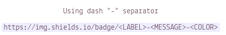
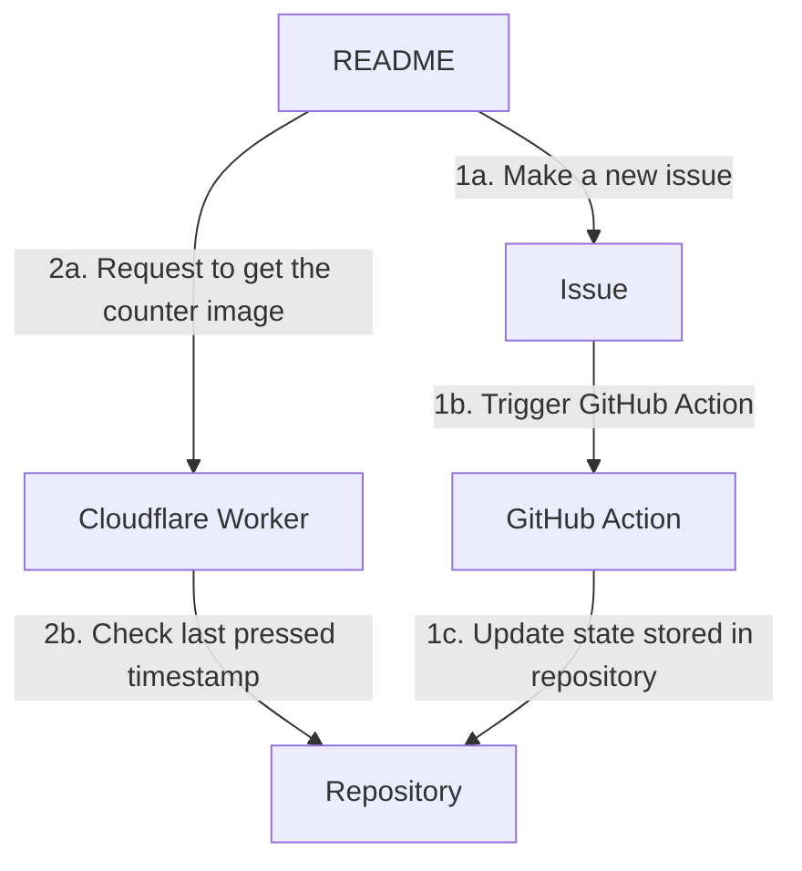

# Blog Post

# GitHub Profile README's and The Button

I just started using this [new GitHub feature](https://docs.github.com/en/github/setting-up-and-managing-your-github-profile/managing-your-profile-readme) which allows you to have a markdown file displayed among your GitHub profile. I decided to remake the [Reddit's The Button](https://en.wikipedia.org/wiki/The_Button_(Reddit)) on my GitHub profile.

# Action 🎬

GitHub actions for on issue.

# Cloudflare Workers ☀️

Now, we want some way to display the counter to anyone visiting my profile. I opted to use [Shields.io](https://shields.io/) because it's easy to display custom badges from calling their endpoint.

We store the timestamp of when the button was last pressed, but how do we set that as the label?

We need to setup some simple logic to retrieve the timestamp, determine the correct colour and return something visual to the user. I used a Cloudflare Worker for this ([Code here](#)).

The Button has three components, the [git repo](https://github.com/Raieen/Raieen) which stores the state of the button. The state of the button is made of up three text files, `last_pressed.txt` which has the last pressed timestamp, `log.txt` which is a log of everyone who pressed the button used to make the list of recent button pushes and `score.txt` which records the total score for everyone, used for the leaderboards.

*[Can't see the diagram? Click here to view in browser.](https://mermaid-js.github.io/mermaid-live-editor/)*

